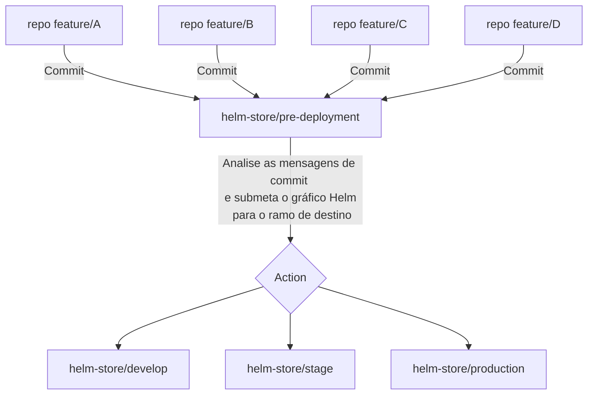

Esta arquitetura operacional foi estabelecida para funcionar como um catálogo Helm para a organização Matrix.

A arquitetura funciona da seguinte maneira:

Vários repositórios, identificados como repositório A, B, C e D, realizam commits no repositório store chamado helm-store/pre-deployment.
Uma vez no helm-store/pre-deployment, os commits são analisados para verificar as mensagens de commit e submeter o gráfico Helm à branch de destino apropriada. Esta etapa é identificada como uma Ação.
Dependendo da análise da mensagem de commit, o gráfico Helm pode ser encaminhado para uma das três branches no repositório helm-store: develop, stage ou production.

